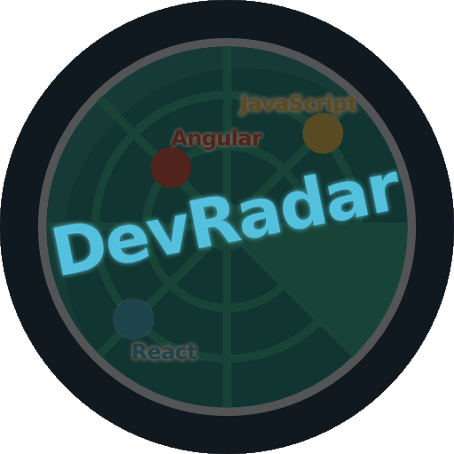

<h1 align="center">
  
</h1>

  DevRadar é uma ferramenta criada pela Rocketseat para ser programada duarante a semana OmniStack 10.0.

  Sua mecânica vai permitir cadastrar por uma interface web no desktop desenvolvedores, quais tecnologias eles dominam e aonde moram, assim pelo app mobile será possível filtrar quais desenvolvedores de determinadas tecnologias moram perto de você.

<h2> Cronograma de aulas </h2>
<ul>
  <li><b>13/01</b> - Conhecendo a OmniStack</li>
  <li><b>14/01</b> - Criando a base da aplicação</li>
  <li><b>15/01</b> - Construindo a interface web</li>
  <li><b>16/01</b> - Desenvolvendo o app mobile</li>
  <li><b>17/01</b> - Funcionalidades avançadas</li>
</ul>

<h2> Tecnologias utilizadas </h2>
<ul>
  <li>Node.js</li>
  <li>Mongodb Atlas</li>
</ul>

<small>
Logo modificado, autor do icone original: <a href="https://www.flaticon.com/authors/dinosoftlabs" target="_blank" title="DinosoftLabs">DinosoftLabs</a> from <a href="https://www.flaticon.com/" target="_blank" title="Flaticon"> www.flaticon.com</a>
</small>
